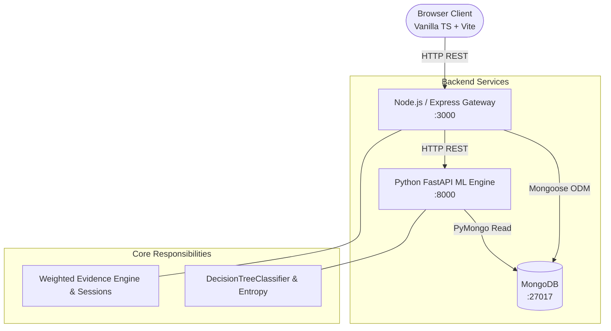

# 🧠 Mind-Mancer

Mind-Mancer is an adaptive AI-driven character guessing game inspired by 20 Questions and Akinator. Players think of a character, and the oracle asks targeted questions to deduce their identity. The system pairs a **Scikit-Learn Decision Tree** for question selection with a deterministic, **Weighted Evidence Engine** that gracefully handles fuzzy human answers (`Probably`, `Don't Know`, `Probably Not`).

---

## ✨ Key Features

- **Adaptive Question Selection**: Uses tree feature importances and class entropy to pick questions that best partition remaining candidates.
- **Fuzzy Tri-State Answers**: Supports `YES`, `PROBABLY`, `DONT_KNOW`, `PROBABLY_NOT`, and `NO` without brittle binary elimination.
- **Weighted Evidence Engine**: Deterministic Bayesian-inspired probability scoring that updates candidate confidence after every answer.
- **Missing Trait Resilience**: Unrecorded traits are treated strictly as `UNKNOWN` (neutral weight), never as `FALSE`.
- **Persistent Knowledge Handoff**: When the oracle makes an incorrect guess, players can teach it the character and a distinguishing trait.
- **Automated Background Retraining**: New knowledge is saved to MongoDB and triggers serialized model retraining with zero-downtime atomic model swaps.
- **Hardened Backend Gateway**: Includes sliding-window rate limiting, 64KB payload caps, UUID v4 validation, and bounded in-memory session management (5,000 sessions with LRU eviction).
- **Comprehensive Test Coverage**: 145 automated tests across all tiers plus 24 live end-to-end integration scenarios.

---

## 🏗️ Architecture Overview



- **Frontend**: Lightweight single-page application communicating exclusively with the Node gateway.
- **Node.js Gateway**: Manages game sessions, user input validation, rate limiting, and candidate evidence scoring.
- **Python ML Microservice**: Fits the `DecisionTreeClassifier` on MongoDB data and evaluates information gain for unasked questions.
- **MongoDB**: The single canonical source of truth for all characters, features, and learned traits.

---

## ⚙️ How It Works

1. **Question Guidance (Decision Tree)**: The Python service fits a Scikit-Learn `DecisionTreeClassifier` (using entropy) to evaluate which feature provides the highest information gain across the active candidate pool.
2. **Candidate Ranking (Evidence Engine)**: Pure decision trees struggle with uncertain answers like *"Probably"*. The Node gateway applies multiplicative evidence weights to candidate scores, maintaining continuous confidence rankings rather than hard binary pruning.
3. **Guess Trigger**: Once a candidate crosses the confidence threshold ($\ge 65\%$ with a $\ge 30\%$ lead) or questions reach 20, the oracle presents its prediction.

---

## 🎓 Knowledge Handoff & Learning Flow

```text
Wrong Guess ❌ ──► Teaching Form ──► Input Validation ──► MongoDB Persistence ──► Serialized /retrain ──► Atomic Model Swap ──► Ready in Next Game
```

When the oracle guesses incorrectly, the user submits the correct character name, a distinguishing question, and a boolean trait value. The backend persists the updates to MongoDB and queues a background retraining request. The ML service retrains the Decision Tree with concurrency locked to 1 and atomically replaces the model artifact in memory.

---

## 🛠️ Technology Stack

| Layer | Technologies |
| :--- | :--- |
| **Frontend** | HTML5, Vanilla CSS3, TypeScript, native DOM APIs, Vite |
| **Backend Gateway** | Node.js (v20+), Express, TypeScript, Mongoose, CORS, dotenv |
| **Machine Learning** | Python 3.11+, FastAPI, Uvicorn, Scikit-Learn, NumPy, Joblib, PyMongo |
| **Database** | MongoDB Community Server (v7.0) |
| **Testing** | Vitest (Frontend & Backend), pytest (ML Engine), tsx (Live E2E) |

---

## 📁 Project Structure

```text
Mind-Mancer/
├── Frontend/          # Vanilla TypeScript client (Vite SPA)
├── backend/           # Node.js + Express API gateway & evidence engine
├── ml-engine/         # Python FastAPI Decision Tree microservice
├── docker-compose.yml # 4-tier container orchestration configuration
├── .env.example       # Environment template
├── LICENSE            # MIT License
└── README.md          # Project documentation
```

*(Detailed engineering documentation, worked algorithmic examples, and interview preparation notes are maintained in `Temp/documentation/DEVELOPER_GUIDE.md`.)*

---

## 🚀 Quick Start

### 1. Prerequisites
- **Node.js**: v20+ or v22+
- **Python**: 3.11+
- **MongoDB**: Local Community Server running on `mongodb://127.0.0.1:27017`

### 2. Configure Environment
```bash
cp .env.example backend/.env
```

### 3. Start Python ML Microservice
```bash
cd ml-engine
python -m venv .venv
# Windows: .\.venv\Scripts\activate | Unix: source .venv/bin/activate
pip install -r requirements.txt
uvicorn app:app --host 127.0.0.1 --port 8000 --reload
```

### 4. Start Node.js API Gateway
```bash
cd backend
npm install
npx tsx src/seed.ts   # (Optional) Seed 12 characters & 16 features
npm run dev           # Runs on http://localhost:3000
```

### 5. Start Frontend Client
```bash
cd Frontend
npm install
npm run dev           # Runs on http://localhost:5173
```

---

## 🧪 Testing Verification

All test suites across the application pass cleanly:

| Suite | Runner | Tests | Status |
| :--- | :--- | :--- | :--- |
| **Backend Gateway** | Vitest | 93 tests (14 files) | **PASS** |
| **Frontend Client** | Vitest | 29 tests (3 files) | **PASS** |
| **ML Engine** | pytest | 23 tests (3 files) | **PASS** |
| **Live Integration (E2E)** | tsx | 24 scenarios against live DB & ML | **PASS** |
| **Total Verified** | — | **145 automated tests + 24 live E2E** | **100% PASS** |

```bash
# Run all test suites
cd backend && npm test
cd ../Frontend && npm test
cd ../ml-engine && pytest
cd ../backend && npm run e2e:live
```

---

## 🐳 Docker

Multi-stage Dockerfiles and a `docker-compose.yml` file are provided for containerized deployment across all four services (`mongodb`, `ml-engine`, `backend`, and `frontend`).  
*(Note: Docker configuration files are structured and provided for convenience, though local container execution was not verified during development due to environment constraints.)*


---

## 🤝 Contributing

Contributions, bug reports, and suggestions are welcome!
1. Fork the repository.
2. Create a feature branch (`git checkout -b feature/improvement-name`).
3. Ensure all tests pass across all three layers (`backend`, `Frontend`, `ml-engine`).
4. Commit your changes (`git commit -m 'feat: add improvement'`).
5. Push to the branch and open a Pull Request.

---

## 📄 License

This project is licensed under the MIT License.
See the [LICENSE](LICENSE) file for details.
